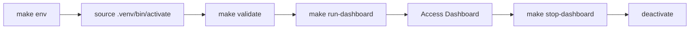

# AMOSKYS Environment Setup Guide

## 🚀 Quick Start (3 Steps)

### 1. Set Up Environment
```bash
make env
```

This will:
- Create virtual environment in `.venv/`
- Install all dependencies from `requirements.txt`
- Create required directories (`logs/`, `data/`)
- Generate protobuf schemas

### 2. Activate Environment
```bash
source .venv/bin/activate
```

**IMPORTANT**: You MUST activate the environment before running AMOSKYS!

### 3. Start Dashboard
```bash
make run-dashboard
```

Access at: **http://127.0.0.1:5000/dashboard/cortex**

---

## 📋 Environment Commands

| Command | Description |
|---------|-------------|
| `make env` | Create and configure environment |
| `make check-env` | Verify environment is activated |
| `make validate` | Validate installation |
| `make env-info` | Show environment details |
| `make shell` | Interactive shell with environment |

---

## ✅ Environment Validation

### Check if Environment is Activated
```bash
make check-env
```

**Expected output**:
```
✅ Virtual environment active: /path/to/.venv
```

**If not activated**:
```
❌ Virtual environment not activated!
   Activate with: source .venv/bin/activate
```

### Validate Installation
```bash
make validate
```

**Checks**:
- ✅ Flask installed
- ✅ psutil installed
- ✅ Flask-SocketIO installed
- ✅ Application structure valid
- ✅ Required directories exist

---

## 🔧 Troubleshooting

### Problem: "Virtual environment not activated"

**Solution**:
```bash
source .venv/bin/activate
```

You'll see `(amoskys)` or `(.venv)` in your terminal prompt.

### Problem: "ModuleNotFoundError"

**Cause**: Dependencies not installed or environment not activated

**Solution**:
```bash
# 1. Activate environment
source .venv/bin/activate

# 2. Reinstall dependencies
make install-deps

# 3. Validate
make validate
```

### Problem: "make env" fails

**Cause**: Python version or missing system dependencies

**Solution**:
```bash
# Check Python version (need 3.9+)
python3 --version

# If < 3.9, install newer Python first
# macOS: brew install python@3.11
# Ubuntu: sudo apt install python3.11

# Then retry
make env
```

### Problem: Port 5000 already in use

**Cause**: Another service using port 5000

**Solution**:
```bash
# Stop existing AMOSKYS
make stop-dashboard

# Or kill the process
lsof -ti :5000 | xargs kill -9

# Restart
make run-dashboard
```

---

## 🎯 Dashboard Management

### Start Dashboard
```bash
# Method 1: Using make (recommended)
source .venv/bin/activate
make run-dashboard

# Method 2: Using script directly
./start_amoskys.sh
```

### Stop Dashboard
```bash
make stop-dashboard
# or
./stop_amoskys.sh
```

### Restart Dashboard
```bash
make restart-dashboard
```

### Check Status
```bash
make status
```

### View Logs
```bash
make logs-dashboard
# or
tail -f logs/flask.log
```

---

## 📦 Dependencies

### Core Dependencies
- Python 3.9+
- Flask 3.1.0
- psutil 6.1.1
- Flask-SocketIO 5.3.6
- protobuf 5.28.2
- grpcio 1.66.2

### Install/Update Dependencies
```bash
# Activate environment first!
source .venv/bin/activate

# Install from requirements.txt
make install-deps

# Or manually
pip install -r requirements.txt
```

### Update Single Package
```bash
source .venv/bin/activate
pip install --upgrade flask
```

### Freeze Current Dependencies
```bash
source .venv/bin/activate
pip freeze > requirements.txt
```

---

## 🔐 Environment Variables

### Required (Development)
```bash
export FLASK_APP=wsgi:app
export FLASK_DEBUG=True
export PYTHONPATH=src:$PYTHONPATH
```

### Optional
```bash
export SECRET_KEY=your-secret-key-here  # Production only
export LOG_LEVEL=DEBUG                   # Default: INFO
```

### Set via Script
The `start_amoskys.sh` script automatically sets these variables.

---

## 🧪 Testing

### Run Tests
```bash
# Activate environment
source .venv/bin/activate

# Run all tests
make test

# Run with coverage
make test-coverage
```

### Validate Environment Before Testing
```bash
make validate && make test
```

---

## 🚨 Common Errors & Fixes

### Error: `command not found: make`

**Solution**: Install make
```bash
# macOS
xcode-select --install

# Ubuntu/Debian
sudo apt install make
```

### Error: `No module named 'flask'`

**Cause**: Environment not activated

**Solution**:
```bash
source .venv/bin/activate
make validate
```

### Error: `Permission denied: ./start_amoskys.sh`

**Solution**:
```bash
chmod +x start_amoskys.sh stop_amoskys.sh
```

### Error: `sqlite3.OperationalError: unable to open database`

**Cause**: Missing data directory

**Solution**:
```bash
mkdir -p data/wal
make run-dashboard
```

---

## 📚 Additional Resources

- **Full Documentation**: [DASHBOARD_ACCESS.md](DASHBOARD_ACCESS.md)
- **API Reference**: http://127.0.0.1:5000/api/docs
- **Makefile Help**: `make help`

---

## ✨ Best Practices

### 1. Always Activate Environment
```bash
# Before ANY command
source .venv/bin/activate
```

### 2. Use Make Commands
```bash
# Preferred
make run-dashboard

# Instead of
python web/wsgi.py
```

### 3. Check Status Regularly
```bash
make status
```

### 4. Monitor Logs
```bash
# In separate terminal
tail -f logs/flask.log
```

### 5. Validate After Changes
```bash
make validate
```

---

## 🔄 Update Workflow

### Updating Dependencies
```bash
# 1. Activate environment
source .venv/bin/activate

# 2. Update requirements.txt (manually)
# Edit requirements.txt

# 3. Install updated deps
make install-deps

# 4. Validate
make validate

# 5. Restart dashboard
make restart-dashboard
```

### Updating Code
```bash
# 1. Pull latest code
git pull

# 2. Update dependencies if needed
make install-deps

# 3. Regenerate protobuf if changed
make proto

# 4. Restart
make restart-dashboard
```

---

## 🎓 Environment Lifecycle



1. **Setup**: `make env` - Creates environment
2. **Activate**: `source .venv/bin/activate` - Activates environment
3. **Validate**: `make validate` - Ensures everything works
4. **Run**: `make run-dashboard` - Starts services
5. **Use**: Access http://127.0.0.1:5000/dashboard/cortex
6. **Stop**: `make stop-dashboard` - Stops services
7. **Deactivate**: `deactivate` - Exits environment

---

**Last Updated**: 2025-12-04
**Version**: AMOSKYS v2.4
