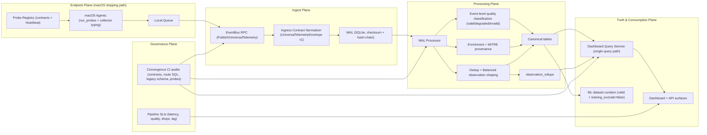

# AMOSKYS Technical Sketch

```mermaid
flowchart LR
    subgraph EP["Endpoint Plane (macOS shipping path)"]
        A["macOS Agents (run_probes + collector typing)"] --> B["Local Queue"]
        R["Probe Registry (contracts + heartbeat)"] --> A
    end

    subgraph ING["Ingest Plane"]
        B --> C["EventBus RPC (Publish/UniversalTelemetry)"]
        C --> D["Ingress Contract Normalizer (UniversalTelemetryEnvelope v1)"]
        D --> E["WAL (SQLite, checksum + hash-chain)"]
    end

    subgraph PROC["Processing Plane"]
        E --> F["WAL Processor"]
        F --> G["Event-level quality classification (valid/degraded/invalid)"]
        F --> H["Enrichment + MITRE provenance"]
        F --> I["Dedup + Balanced observation shaping"]
        G --> J["Canonical tables"]
        H --> J
        I --> J
        I --> K["observation_rollups"]
    end

    subgraph QRY["Truth & Consumption Plane"]
        J --> L["Dashboard Query Service (single query path)"]
        K --> L
        L --> M["Dashboard + API surfaces"]
        J --> N["ML dataset curation (valid + training_exclude=false)"]
    end

    subgraph GOV["Governance Plane"]
        O["Convergence CI audits (contracts, route SQL, legacy schema, probes)"] --> C
        O --> F
        O --> L
        P["Pipeline SLIs (latency, quality, drops, lag)"] --> M
    end
```
